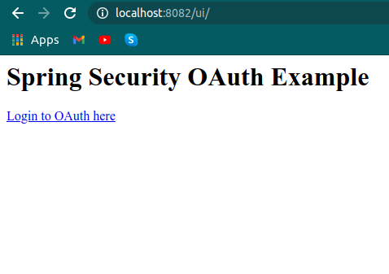
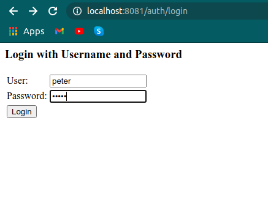
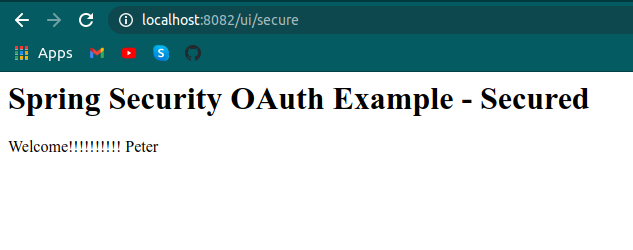
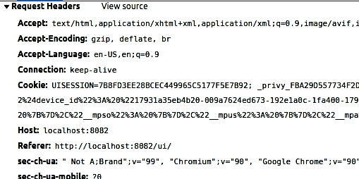

# Spring Security OAuth

- `spring-security-client` - Client Project which has the UI 
- `spring-security-auth-server` - Has the Authorization Server and Resource Server
- `http://localhost:8082/ui` - REST end point for UI which will take you to the secure URI `http://localhost:8082/secure` after logging into the auth server `http://localhost:8081/auth/login`

### Client is running on ```port:8082```. In order to access any secure resources the client needs to acquire an auth token



### Since the client doesn't have any token, the request is auto forwarded to the auth-server running on ```port:8081```. The client needs to login with necessary credentials to get the auth token from ```auth+resource``` server



### After successful login the client is then again forwarded to the request pag on ```port:8082```



### In the request headed we cans see a cookie is generated which we are using to authorize

